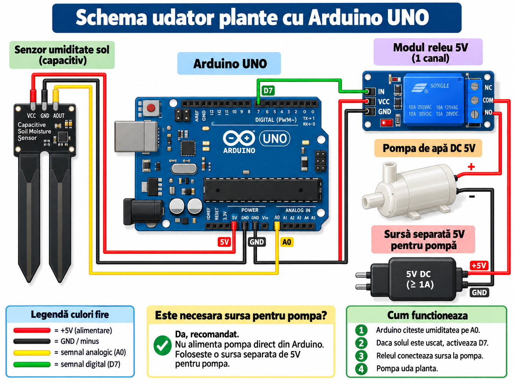

# Udător automat pentru plante cu Arduino UNO

Un proiect pentru școală care citește umiditatea solului și comandă o pompă de apă printr-un releu. **Tot codul, inclusiv calibrarea, se află într-un singur fișier:** [arduino-plant-watering.ino](arduino-plant-watering.ino).

Calibrarea se face din Serial Monitor și se salvează în memoria EEPROM, astfel încât valorile să rămână după oprirea alimentării. Nu trebuie să instalezi biblioteci suplimentare: EEPROM este inclusă în pachetul Arduino AVR.

## Schema montajului



Imaginea este schema trimisă pentru proiect, salvată în format JPG pentru a se încărca mai repede. **Pentru montaj, urmează etichetele pinilor și tabelul de mai jos**, nu poziția desenată a conectorilor. Firul VCC al releului trebuie legat explicit la 5V Arduino, chiar dacă traseul său nu este complet clar în imagine.

## Componente necesare

| Componentă | Rol |
|---|---|
| Arduino UNO și cablu USB | Citește senzorul și comandă releul |
| Senzor capacitiv de umiditate a solului, compatibil cu 5V | Oferă semnalul analogic AOUT |
| Modul releu 5V, un canal | Comută alimentarea pompei |
| Pompă DC de 5V | Transportă apa către plantă |
| Sursă separată stabilizată 5V | Alimentează pompa; curentul trebuie să acopere și pornirea pompei |
| Furtun potrivit, rezervor de apă și fire | Completează montajul |

Sursa din imagine este de minimum 1A, dar verifică necesarul pompei tale. Arduino poate fi alimentat prin USB. Folosește un **modul de releu**, care are circuitul de comandă inclus, nu un releu simplu conectat direct la D7.

## Cum legi firele

Fă legăturile cu alimentările deconectate.

| De la | La |
|---|---|
| Senzor VCC | 5V Arduino |
| Senzor GND | GND Arduino |
| Senzor AOUT / AO | A0 Arduino |
| Releu VCC | 5V Arduino |
| Releu GND | GND Arduino |
| Releu IN | D7 Arduino |
| Plusul sursei separate de 5V | COM releu |
| NO releu | Firul pozitiv al pompei |
| Firul negativ al pompei | Minusul sursei separate |
| NC releu | Rămâne neconectat |

1. Leagă senzorul la 5V, GND și A0. AOUT este ieșirea analogică.
2. Leagă partea de comandă a releului la 5V, GND și D7. Senzorul și releul folosesc masa Arduino.
3. Leagă plusul sursei pompei la COM, apoi NO la plusul pompei.
4. Leagă minusul pompei direct la minusul sursei sale.
5. Conectează furtunul la ieșirea indicată de producătorul pompei. Respectă tipul acesteia: o pompă submersibilă se folosește conform instrucțiunilor sale și nu se pornește fără apă.

**COM** este contactul comun. **NO** este deschis în repaus, astfel încât pompa rămâne oprită când releul nu este activat. **NC** este închis în repaus și nu se folosește aici.

Contactele releului separă circuitul pompei de circuitul de comandă; pentru acest montaj cu releu, minusul sursei pompei nu trebuie conectat la GND Arduino. Nu conecta plusul sursei pompei la 5V Arduino și nu alimenta pompa dintr-un pin al plăcii.

Pentru o pompă DC cu motor cu perii, o diodă de protecție dimensionată pentru motor se montează în paralel cu pompa, cu catodul (capătul cu bandă) la plus și anodul la minus. Dioda modulului de releu protejează bobina releului, nu motorul pompei.

## Cum încarci codul în Arduino IDE

1. Pe GitHub apasă **Code → Download ZIP** și dezarhivează proiectul.
2. Folderul sketch-ului trebuie să se numească **arduino-plant-watering**, exact ca fișierul .ino. Dacă arhiva creează folderul arduino-plant-watering-main, redenumește-l.
3. Deschide fișierul **arduino-plant-watering.ino** în Arduino IDE.
4. Conectează Arduino prin USB.
5. Selectează **Arduino Uno** și portul plăcii din meniul **Tools** sau selectorul de placă.
6. Apasă **Verify**, apoi **Upload**.
7. Deschide **Serial Monitor** la **9600 baud**.

După Upload, programul rulează pe placă. Nu trebuie să păstrezi IDE-ul deschis pentru udare. Deschiderea Serial Monitor poate reseta UNO; programul reîncarcă valorile salvate și așteaptă 60 de secunde înainte de udare.

## Cum funcționează, pas cu pas

**Prima dată — îl calibrezi o singură dată:**

1. Arduino rămâne alimentat prin USB, dar **deconectezi alimentarea separată a pompei** cât faci calibrarea.
2. Pui partea sensibilă a senzorului în pământ uscat. Păstrezi electronica și conectorul uscate.
3. În Serial Monitor la **9600 baud** scrii litera mică `c` și apeși Send/Enter. Nu mai trebuie alte comenzi pentru calibrare.
4. La **10 secunde** după `c`, Arduino citește și reține singur valoarea pentru sol uscat. Îți afișează „Acum muta senzorul in sol foarte umed”.
5. Muți senzorul în pământ foarte umed și îl lași să se stabilizeze. La **20 de secunde de la primul mesaj**, Arduino citește valoarea pentru sol umed. Dacă valorile sunt valide și diferă cu cel puțin 50 RAW, le **salvează singur în EEPROM** și activează udarea automată. Dacă apare „Calibrare esuata”, reiei de la pasul 2.
6. Pui senzorul în ghiveciul pe care vrei să-l ude și reconectezi sursa separată a pompei după ce verifici firele. Prima udare poate începe la **60 de secunde după salvare**, numai dacă pământul este uscat.

Arduino are nevoie de ambele probe, una uscată și una umedă. Nu poate afla pragurile corecte dintr-o singură citire. Nu trebuie să trimiți `u`, `w`, `s` sau `a` la calibrarea obișnuită; acele comenzi de calibrare din versiunea veche nu mai sunt folosite.

**În fiecare zi — funcționează singur:**

- Arduino citește senzorul aproximativ la fiecare 250 ms și afișează în Serial Monitor valoarea brută `RAW`, procentul relativ și starea pompei. Nu trebuie să ții calculatorul conectat ca să ude.
- Dacă solul arată **35% sau mai puțin**, iar pauza s-a terminat, Arduino activează D7. Releul leagă sursa separată de 5V la pompă prin COM și NO; pompa udă planta.
- Când senzorul arată **55% sau mai mult**, pompa se oprește. După oprire, Arduino așteaptă **60 de secunde** înainte să o poată porni din nou, ca apa să se răspândească prin pământ. Diferența dintre 35% și 55% previne pornirile repetate la oscilații mici.
- Dacă pompa merge **10 secunde continuu** fără să ajungă la 55%, se oprește și **rămâne blocată**. Cele 10 secunde sunt o limită de protecție, iar pauza de 60 de secunde nu o deblochează. Verifici apa, furtunul și poziția senzorului, apoi trimiți `r` și după aceea `a`.
- Dacă citirea senzorului ajunge foarte aproape de 0 sau 1023, codul oprește udarea automată. După ce repari conexiunea și vezi o citire normală, trimiți `a`. Această verificare nu detectează toate defecțiunile; un senzor scos poate afișa și valori intermediare.

**La următoarea alimentare:** Arduino recitește calibrarea salvată și activează singur modul automat. Așteaptă 60 de secunde înainte de prima udare. Poți să-l alimentezi cu un încărcător USB în locul calculatorului; pompa continuă să aibă sursa ei separată. Comanda `o` și blocarea de 10 secunde nu se salvează în EEPROM: după o repornire, dacă există calibrare validă, modul automat se reactivează. De aceea, dacă pompa a atins limita, verifică montajul înainte să o alimentezi din nou.

**Exemplu:** arată 30% → pompa pornește → apa ajunge la senzor și arată 55% → pompa se oprește → urmează pauza de 60 de secunde. Dacă nu ajunge la 55% în primele 10 secunde, se blochează și așteaptă verificarea ta.

Procentul este **relativ la cele două probe de sol folosite la calibrare**; nu măsoară exact cantitatea de apă din pământ. Pragurile și timpii se pot ajusta în constantele de la începutul fișierului `.ino`, după teste supravegheate.

## Toate comenzile din Serial Monitor

Setează Serial Monitor la **9600 baud**. Scrie **o singură literă mică** și apasă **Send/Enter**; programul ignoră caracterele de sfârșit de linie. Comenzile se folosesc la prima calibrare sau dacă intervii manual, nu la fiecare udare.

| Comandă | Ce face exact | Când o folosești |
|---|---|---|
| `c` | Oprește pompa și modul automat, începe calibrarea de la zero. Citește uscat după 10 s, apoi umed după încă 20 s, verifică și salvează automat. Dacă o trimiți din nou, reia cronometrarea de la început. | Prima dată sau când schimbi senzorul/solul și vrei recalibrare. |
| `h` | Afișează lista scurtă de instrucțiuni în Serial Monitor. Nu schimbă starea pompei. | Când vrei să revezi comenzile. |
| `a` | Activează modul automat numai dacă există calibrare validă, citirea senzorului este plauzibilă și nu există blocare de 10 s. **Nu forțează pornirea imediată a pompei**: contează pragul de 35% și pauza. | După `o`, după repararea unei citiri greșite sau după `r`. Nu e necesară după o calibrare reușită. |
| `o` | Oprește imediat pompa și modul automat; anulează și o calibrare aflată în curs. Calibrarea deja salvată în EEPROM rămâne salvată. | Când vrei să oprești temporar sistemul. |
| `r` | Oprește pompa, dezactivează modul automat și șterge blocarea de 10 s; pornește o nouă pauză de 60 s. **Nu pornește singură udarea**; după verificarea montajului, trimiți și `a`. | Numai după mesajul „LIMITA 10s”. |

`u`, `w` și `s` din versiunea veche nu au nicio funcție în codul actual și sunt ignorate.

## Releu activ LOW sau HIGH

Codul folosește inițial:

```cpp
const bool RELAY_ACTIVE_LOW = true;
```

Asta înseamnă LOW pentru activare și HIGH pentru oprire. Verifică specificațiile modulului tău. Dacă este activ HIGH, schimbă valoarea în **false** și reîncarcă programul. Testează cu alimentarea pompei deconectată.

Programul pregătește nivelul de oprire înainte de configurarea D7 ca ieșire. Comportamentul releului în timpul resetării, înainte să ruleze codul, depinde de modul și de circuitul de intrare al acestuia.

## Testare și probleme frecvente

| Situație | Ce verifici |
|---|---|
| RAW nu variază | AOUT la A0, VCC și GND, senzor introdus în sol |
| Releul lucrează invers | Valoarea RELAY_ACTIVE_LOW |
| Releul clicăie, pompa nu merge | COM și NO, sursa separată, polaritatea și necesarul pompei |
| Pompa se blochează după 10 secunde | Rezervorul, furtunul, debitul și poziția senzorului; r apoi a după verificare |
| Nu începe imediat udarea | Calibrarea, modul automat, pragul de 35% și pauza de 60 secunde |
| Arduino se resetează când pornește pompa | Sursa pompei, firele, interferențele motorului și dioda de protecție |

Ține apa departe de Arduino, releu și conexiunile electrice. Folosește doar partea de joasă tensiune a unei surse gata construite; nu conecta tensiunea de la priză la montaj. Prima testare se face supravegheat. Fără senzor de nivel, programul nu poate detecta un rezervor gol.

## Prezentare pentru școală

Vezi [prezentarea scurtă](docs/prezentare-scurta.md), cu rolul componentelor și explicația funcționării.

## Structura proiectului

| Fișier | Conținut |
|---|---|
| arduino-plant-watering.ino | Singurul sketch: calibrare, EEPROM și udare |
| README.md | Montaj, utilizare și depanare |
| docs/prezentare-scurta.md | Text de prezentare |
| images/schema-udator-plante.jpg | Schema trimisă, convertită în JPG |

## Referințe Arduino

- [Încărcarea unui sketch](https://support.arduino.cc/hc/en-us/articles/4733418441116-Upload-a-sketch-in-Arduino-IDE)
- [Memoria EEPROM](https://docs.arduino.cc/learn/built-in-libraries/eeprom/)
- [analogRead](https://docs.arduino.cc/language-reference/en/functions/analog-io/analogRead/)
